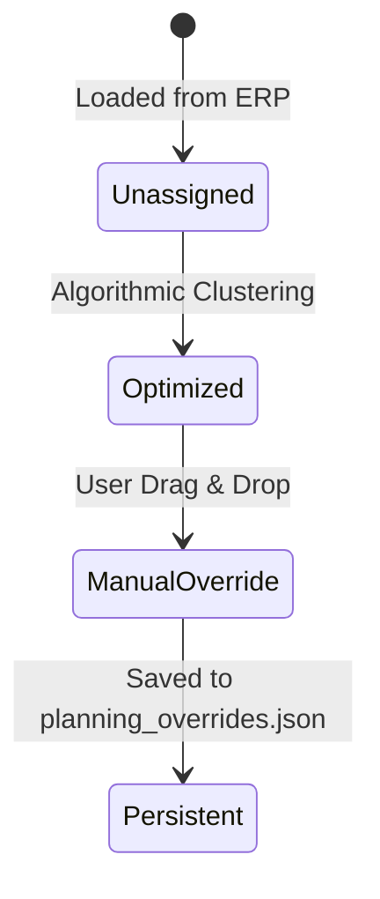

# Data Model: 01 - Planung Maschinen

## Data Entities & Schemas

### 1. JobStep (Arbeitsgang-Karten Objekt)

Represents an individual machining step scheduled on a CNC machine column.

```typescript
interface JobStep {
  stepId: string;                 // Composite key: "{orderId}_{AR_STEP}" (e.g. "100234_10")
  orderId: string;                // ERP Belp Order ID (e.g. "100234")
  articleId: string;              // Article SKU (e.g. "ART-9842")
  articleName: string;            // Descriptive article title
  orderQty: number;               // Planned lot size
  remainingQty: number;           // Uncompleted lot size
  AR_STEP: number;                // Routing step number (10, 20, 30...)
  stepName: string;               // Step description (e.g. "Fräsen OP10")
  setupTimeMin: number;           // Target setup duration in minutes
  runTimeMin: number;             // Target total run time for lot in minutes
  totalTimeMin: number;           // Calculated sum: setupTimeMin + runTimeMin
  contractNumber: string;         // Customer/Contract ID for getContractColor()
  kvStatus: 'green' | 'yellow' | 'red'; // Availability status
  ncProgram: string | null;       // Associated NC file name (e.g. "O9842_10.NC")
  fixture: string | null;         // Assigned fixture ID (e.g. "V-1029")
  toolListNr: string | null;      // Associated WinTool list ID (e.g. "TL-4491")
  isNightRunCapable: boolean;     // Can run unmanned overnight
  posQuantity: number;            // Total pieces in P-Auftrag position
  avgPieceTime: number;           // Calculated avg piece time (runTimeMin / posQuantity)
  maxPiecesPerNight: number;      // Max pieces loadable for night run
  maxNightCapacityMin: number;    // Calculated max night capacity (maxPiecesPerNight * avgPieceTime)
  dayShiftMin: number;            // Minutes scheduled within Day Window limit (<= DayCapacity)
  nightShiftMin: number;          // Minutes scheduled for Night Run (<= min(maxNightCapacityMin, 1440 - dayShiftMin))
  manualMachineOverride: string | null; // Manual machine assignment override if present
}
```

---

### 2. MachineColumn

Represents a CNC machining station column in the Kanban board.

```typescript
interface MachineColumn {
  machineName: string;            // CNC machine name (e.g. "Hermle C400")
  totalCapacityHours: number;     // Available hours based on daysCount * 24h limit
  dayShiftHours: number;          // Hours allocated in day shift window (capped by DayCapacity)
  nightShiftHours: number;        // Hours allocated in unmanned night shift
  scheduledHours: number;         // Total setup + run time assigned (dayShiftHours + nightShiftHours <= 24h/day)
  utilizationPercent: number;     // (scheduledHours / totalCapacityHours) * 100
  days: Record<string, JobStep[]>; // Map of YYYY-MM-DD to array of JobSteps
}
```


---

### 3. PlanningOverrideRecord

Represents a persistent user override entry in `planning_overrides.json`.

```typescript
interface PlanningOverrideRecord {
  stepId: string;                 // Composite step ID ("100234_10")
  overrideMachine: string;        // Target machine name
  startDate: string;              // Target start date (YYYY-MM-DD)
  timestamp: string;              // ISO timestamp of edit
  manualOverride: boolean;        // Always true
}
```

---

### State Transitions


