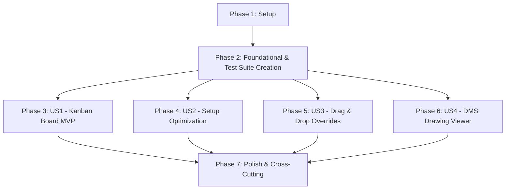

# Tasks: 01 - Planung Maschinen (Kanban-Maschinenbelegungsplanung)

**Input**: Design documents from [`specs/001-planung-maschinen/`](file:///C:/git_repos/ToolListInsights/specs/001-planung-maschinen/)  
**Prerequisites**: [`plan.md`](file:///C:/git_repos/ToolListInsights/specs/001-planung-maschinen/plan.md), [`spec.md`](file:///C:/git_repos/ToolListInsights/specs/001-planung-maschinen/spec.md), [`research.md`](file:///C:/git_repos/ToolListInsights/specs/001-planung-maschinen/research.md), [`data-model.md`](file:///C:/git_repos/ToolListInsights/specs/001-planung-maschinen/data-model.md), [`contracts/planning-api.json`](file:///C:/git_repos/ToolListInsights/specs/001-planung-maschinen/contracts/planning-api.json)

**Tests Requirement**: **MANDATORY** — Re-implement the missing test suite (`Features/01_Planung_Maschinen/test.js` & `Features/run_tests.js`) as foundational and story-specific tasks.

---

## Format: `[ID] [P?] [Story] Description`

- **[P]**: Can run in parallel (different files, no dependencies)
- **[Story]**: User story label (US1, US2, US3, US4)
- Includes exact file paths for every task

---

## Phase 1: Setup (Shared Infrastructure)

**Purpose**: Project environment and dependency verification

- [x] T001 Verify project structure for backend and frontend per [`plan.md`](file:///C:/git_repos/ToolListInsights/specs/001-planung-maschinen/plan.md) in `package.json`
- [x] T002 Verify React 19, Vite 8, Recharts 3, and Lucide React dependencies in `frontend/package.json`
- [x] T003 [P] Configure environment fallback parameters and database configs in `docker-compose.yml`

---

## Phase 2: Foundational (Blocking Prerequisites & Test Suite Re-implementation)

**Purpose**: Core database connections, persistent override storage, and re-creation of the missing test runner framework before user story implementation

**⚠️ CRITICAL**: No user story implementation can begin until foundational tasks and test harnesses are in place.

- [x] T004 [P] Re-implement master test runner script `Features/run_tests.js` using native `node:assert`
- [x] T005 [P] Implement dynamic MS SQL Server database pool builder (`msnodesqlv8` / `tedious`) in `backend/db.js`
- [x] T006 Re-implement feature unit & contract test suite harness in `Features/01_Planung_Maschinen/test.js`
- [x] T007 Implement database mode toggle (`live` vs `dev`) endpoints in `backend/server.js`
- [x] T008 [P] Initialize persistent JSON override file in `backend/planning_overrides.json`

**Checkpoint**: Foundation & test harness ready — user story implementation can now begin.

---

## Phase 3: User Story 1 - Interactive Kanban Belegungsplanung (Priority: P1) 🎯 MVP

**Goal**: Display CNC machine Kanban columns with utilization metrics, scheduled job cards, and flexible day horizons (5 to 21 days).

**Independent Test**: Run `node Features/01_Planung_Maschinen/test.js` for US1 tests and verify `GET /api/planning?daysCount=5` payload.

### Tests for User Story 1

- [x] T009 [P] [US1] Write test assertions for schedule calculation and capacity metrics in `Features/01_Planung_Maschinen/test.js`

### Implementation for User Story 1

- [x] T010 [P] [US1] Define JobStep data structures in `backend/models/jobStep.js`
- [x] T011 [US1] Implement schedule calculation endpoint `GET /api/planning` in `backend/server.js`
- [x] T012 [P] [US1] Implement deterministic contract color helper `getContractColor` in `frontend/src/utils/colors.js`
- [x] T013 [P] [US1] Build Kanban job card component in `frontend/src/components/JobCard.jsx`
- [x] T014 [US1] Build Kanban column grid view in `frontend/src/App.jsx` supporting day horizon switches (5, 7, 10, 14, 21 days)
- [x] T015 [US1] Add status badges (Green, Yellow, Red) and machine utilization headers in `frontend/src/components/MachineHeader.jsx`

**Checkpoint**: User Story 1 MVP fully functional and testable independently.

---

## Phase 4: User Story 2 - Rüst- und Geisterschicht-Optimierung (Priority: P2)

**Goal**: Re-order job steps using Greedy / Local Search algorithms by tool list IDs (`ZzIdent`) and fixtures (`fixture`), positioning night-capable jobs over night shifts.

**Independent Test**: Run setup optimization tests in `Features/01_Planung_Maschinen/test.js` and verify setup time reduction.

### Tests for User Story 2

- [x] T016 [P] [US2] Write test assertions for setup optimization and night-shift job positioning in `Features/01_Planung_Maschinen/test.js`

### Implementation for User Story 2

- [x] T017 [P] [US2] Implement setup optimization engine (`greedy`, `local_search`, `simulated_annealing`) in `backend/server.js`
- [x] T018 [US2] Implement unmanned night-shift scheduling algorithm placing `isNightRunCapable` jobs at shift end in `backend/server.js`
- [x] T019 [US2] Add optimization control toggles and algorithm selection dropdown in `frontend/src/components/ControlBar.jsx`

**Checkpoint**: User Stories 1 AND 2 both functional independently.

---

## Phase 5: User Story 3 - Drag & Drop Manual Overrides & Splitting (Priority: P3)

**Goal**: Enable manual drag-and-drop job moves between machines/dates with persistence to `planning_overrides.json` and support job splitting.

**Independent Test**: Verify POST `/api/planning/override` persistence in `Features/01_Planung_Maschinen/test.js`.

### Tests for User Story 3

- [x] T020 [P] [US3] Write test assertions for POST `/api/planning/override` persistence in `Features/01_Planung_Maschinen/test.js`

### Implementation for User Story 3

- [x] T021 [US3] Implement `POST /api/planning/override` endpoint writing to `backend/planning_overrides.json` in `backend/server.js`
- [x] T022 [P] [US3] Add HTML5 Drag & Drop event handlers to job cards in `frontend/src/components/JobCard.jsx`
- [x] T023 [US3] Implement job lot splitting modal and remaining lot size handler in `frontend/src/components/SplitModal.jsx`

**Checkpoint**: User Stories 1, 2, and 3 functional independently.

---

## Phase 6: User Story 4 - Detail Inspection & d.velop DMS Drawing Viewer (Priority: P4)

**Goal**: Provide job detail modal with routing history, BDE bookings, and d.velop DMS PDF drawing proxy viewer.

**Independent Test**: Test DMS drawing endpoint `GET /api/dms/drawing/:articleId` in `Features/01_Planung_Maschinen/test.js`.

### Tests for User Story 4

- [x] T024 [P] [US4] Write test assertions for d.velop DMS drawing metadata proxy endpoint in `Features/01_Planung_Maschinen/test.js`

### Implementation for User Story 4

- [x] T025 [P] [US4] Implement d.velop DMS drawing proxy streaming endpoint `GET /api/dms/drawing/:articleId` in `backend/server.js`
- [x] T026 [US4] Implement job detail modal with routing history and BDE booking breakdown in `frontend/src/components/DetailModal.jsx`
- [x] T027 [US4] Implement inline PDF drawing viewer with zoom, 90-degree rotation, and sub-document switching in `frontend/src/components/DmsViewerModal.jsx`

**Checkpoint**: All 4 User Stories fully functional independently.

---

## Phase 7: Polish & Cross-Cutting Concerns

**Purpose**: Theme scoping, CSS isolation, and validation

- [x] T028 [P] Enforce strict CSS isolation for `01_Planung_Maschinen` components to guarantee zero side-effects in `frontend/src/index.css`
- [x] T029 Add Light/Dark theme CSS token variables (`[data-theme='dark']` / `[data-theme='light']`) in `frontend/src/index.css`
- [x] T030 Execute master test runner `node Features/run_tests.js` and validate quickstart scenarios in [`quickstart.md`](file:///C:/git_repos/ToolListInsights/specs/001-planung-maschinen/quickstart.md)

---

## Dependencies & Execution Order

---

## Implementation Strategy

### MVP First (User Story 1 Only)
1. Complete Phase 1: Setup
2. Complete Phase 2: Foundational (Includes re-creating test runner `Features/run_tests.js`)
3. Complete Phase 3: User Story 1
4. **STOP and VALIDATE**: Execute `node Features/01_Planung_Maschinen/test.js` for US1

### Incremental Delivery
1. Foundation & Test Suite ready (Phase 1 & 2)
2. Add US1 → Test & Deploy MVP
3. Add US2 → Run setup optimization tests
4. Add US3 → Run override persistence tests
5. Add US4 → Run DMS viewer tests
6. Polish & Final Validation (Phase 7)
