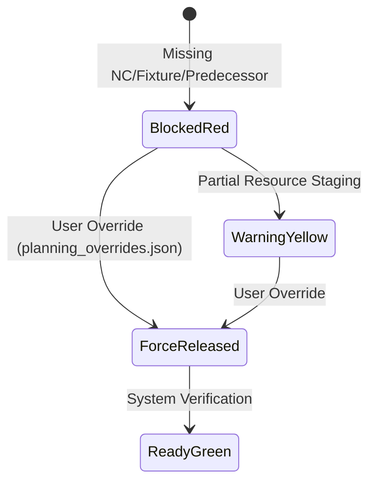

# Data Model: 02 - Planung Maschinen blockiert

## Data Entities & Schemas

### 1. ConflictReason

Represents a specific reason for job blocking or warning.

```typescript
interface ConflictReason {
  code: 'MISSING_NC_PROGRAM' | 'MISSING_FIXTURE' | 'MISSING_TOOL_LIST' | 'PREDECESSOR_NOT_DONE' | 'MATERIAL_DELAY';
  severity: 'CRITICAL' | 'WARNING';
  message: string;
}
```

---

### 2. ConflictJobStep (Extends JobStep)

```typescript
interface ConflictJobStep {
  stepId: string;
  orderId: string;
  articleId: string;
  kvStatus: 'yellow' | 'red';
  conflictReasons: ConflictReason[];
  isForceReleased: boolean;
  forceReleasedBy?: string;
  forceReleasedAt?: string;
}
```

---

### State Transitions


