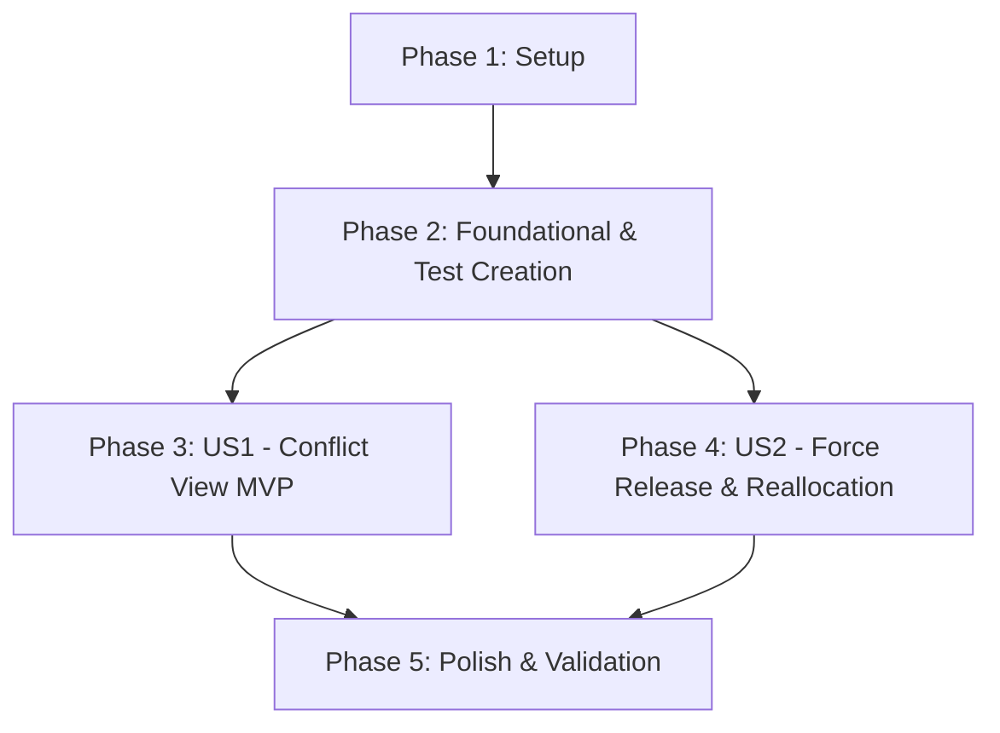

# Tasks: 02 - Planung Maschinen blockiert (KV-Status Gelb & Rot)

**Input**: Design documents from [`specs/002-planung-maschinen-blockiert/`](file:///C:/git_repos/ToolListInsights/specs/002-planung-maschinen-blockiert/)  
**Prerequisites**: [`plan.md`](file:///C:/git_repos/ToolListInsights/specs/002-planung-maschinen-blockiert/plan.md), [`spec.md`](file:///C:/git_repos/ToolListInsights/specs/002-planung-maschinen-blockiert/spec.md), [`research.md`](file:///C:/git_repos/ToolListInsights/specs/002-planung-maschinen-blockiert/research.md), [`data-model.md`](file:///C:/git_repos/ToolListInsights/specs/002-planung-maschinen-blockiert/data-model.md), [`contracts/conflict-api.json`](file:///C:/git_repos/ToolListInsights/specs/002-planung-maschinen-blockiert/contracts/conflict-api.json)

**Tests Requirement**: **MANDATORY** — Implement unit & contract test suite in `Features/02_Planung_Maschinen_Blockiert/test.js` and register with `Features/run_tests.js`.

---

## Format: `[ID] [P?] [Story] Description`

- **[P]**: Can run in parallel (different files, no dependencies)
- **[Story]**: User story label (US1, US2)
- Includes exact file paths for every task

---

## Phase 1: Setup (Shared Infrastructure)

**Purpose**: Environment and project setup for conflict mode

- [x] T001 Verify Feature 02 configuration per [`plan.md`](file:///C:/git_repos/ToolListInsights/specs/002-planung-maschinen-blockiert/plan.md) in `package.json`
- [x] T002 [P] Verify `planning_overrides.json` conflict schema support in `backend/planning_overrides.json`

---

## Phase 2: Foundational (Blocking Prerequisites & Test Suite Creation)

**Purpose**: Core model definitions and test suite initialization for conflict mode

- [x] T003 Implement unit & contract test suite harness for conflict mode in `Features/02_Planung_Maschinen_Blockiert/test.js`
- [x] T004 Register Feature 02 test suite in master test runner `Features/run_tests.js`
- [x] T005 [P] Define ConflictReason and ConflictJobStep data models in `backend/models/conflictStep.js`

**Checkpoint**: Foundation & test harness ready — user story implementation can now begin.

---

## Phase 3: User Story 1 - Dedicated Conflict Filtering View (Priority: P1) 🎯 MVP

**Goal**: Filter routing steps for `isConflictMode === true` and display red/yellow conflict cards with warning banners.

**Independent Test**: Run `node Features/02_Planung_Maschinen_Blockiert/test.js` for US1 tests and verify `GET /api/planning?isConflictMode=true`.

### Tests for User Story 1

- [x] T006 [P] [US1] Write test assertions for conflict mode predicate filtering in `Features/02_Planung_Maschinen_Blockiert/test.js`

### Implementation for User Story 1

- [x] T007 [US1] Implement `isConflictMode` query filtering logic in `backend/server.js`
- [x] T008 [P] [US1] Build conflict header component with total blocked counts and category filters in `frontend/src/components/ConflictHeader.jsx`
- [x] T009 [US1] Build conflict job card banner overlays and red/yellow alert indicators in `frontend/src/components/ConflictJobCard.jsx`
- [x] T010 [US1] Integrate conflict mode tab rendering in `frontend/src/App.jsx`

**Checkpoint**: User Story 1 MVP fully functional and testable independently.

---

## Phase 4: User Story 2 - Manual Conflict Override & Reallocation (Priority: P2)

**Goal**: Allow manual "Force Release" overrides and machine reallocations for blocked jobs with prerequisite validation.

**Independent Test**: Execute Force Release tests in `Features/02_Planung_Maschinen_Blockiert/test.js`.

### Tests for User Story 2

- [x] T011 [P] [US2] Write test assertions for Force Release override logging in `Features/02_Planung_Maschinen_Blockiert/test.js`

### Implementation for User Story 2

- [x] T012 [US2] Implement Force Release action handler updating `planning_overrides.json` in `backend/server.js`
- [x] T013 [P] [US2] Add Force Release button and audit action modal in `frontend/src/components/ForceReleaseModal.jsx`
- [x] T014 [US2] Add machine reallocation dropdown with target machine NC/fixture validation in `frontend/src/components/ConflictJobCard.jsx`

**Checkpoint**: User Stories 1 AND 2 both functional independently.

---

## Phase 5: Polish & Cross-Cutting Concerns

**Purpose**: Scoped CSS isolation, theme tokens, and validation

- [x] T015 [P] Enforce strict scoped CSS isolation for conflict mode components to guarantee zero side-effects in `frontend/src/index.css`
- [x] T016 Execute master test runner `node Features/run_tests.js` and validate quickstart scenarios in [`quickstart.md`](file:///C:/git_repos/ToolListInsights/specs/002-planung-maschinen-blockiert/quickstart.md)

---

## Dependencies & Execution Order

---

## Implementation Strategy

### MVP First (User Story 1 Only)
1. Complete Phase 1: Setup
2. Complete Phase 2: Foundational (Includes test harness creation in `Features/02_Planung_Maschinen_Blockiert/test.js`)
3. Complete Phase 3: User Story 1
4. **STOP and VALIDATE**: Execute `node Features/02_Planung_Maschinen_Blockiert/test.js` for US1

### Incremental Delivery
1. Foundation & Test Suite ready (Phase 1 & 2)
2. Add US1 → Test & Deploy MVP
3. Add US2 → Run Force Release tests
4. Polish & Final Validation (Phase 5)
