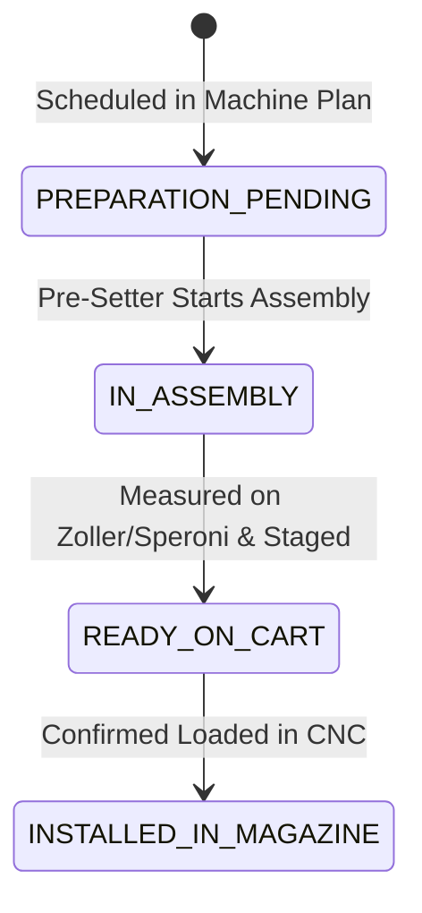

# Data Model: 03 - Planung Werkzeugrüsten

## Data Entities & Schemas

### 1. ToolPresetJob

Represents a tool setup job for a target CNC machine.

```typescript
interface ToolPresetJob {
  toolListNr: string;             // WinTool list ID (e.g. "TL-8841")
  machine: string;                // Target machine name (e.g. "Hermle C30")
  scheduledStartTime: string;     // ISO timestamp of planned machining start
  totalToolsCount: number;        // Total tools in WinTool list
  toolsToSetupCount: number;     // Tools needing assembly (Delta)
  toolsAlreadyInMagazineCount: number; // Tools already present in magazine
  setupStatus: 'PREPARATION_PENDING' | 'IN_ASSEMBLY' | 'READY_ON_CART' | 'INSTALLED_IN_MAGAZINE';
  estimatedSetupDurationMin: number;
}
```

---

### 2. ComponentPickItem

Represents an aggregated cutting insert or tool component for warehouse picking.

```typescript
interface ComponentPickItem {
  componentId: string;           // Insert / Cutter SKU
  description: string;           // Tool description
  totalPickQty: number;          // Aggregated total required
  usedInToolLists: string[];    // Array of TL numbers requiring this component
}
```

---

### State Transitions


