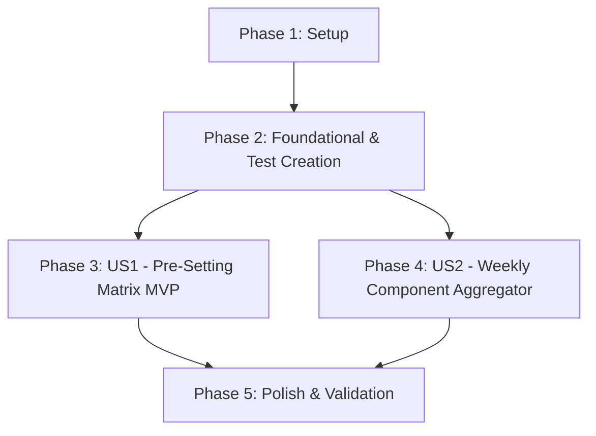

# Tasks: 03 - Planung Werkzeugrüsten (Werkzeugrüst-Planung)

**Input**: Design documents from [`specs/003-planung-werkzeugruesten/`](file:///C:/git_repos/ToolListInsights/specs/003-planung-werkzeugruesten/)  
**Prerequisites**: [`plan.md`](file:///C:/git_repos/ToolListInsights/specs/003-planung-werkzeugruesten/plan.md), [`spec.md`](file:///C:/git_repos/ToolListInsights/specs/003-planung-werkzeugruesten/spec.md), [`research.md`](file:///C:/git_repos/ToolListInsights/specs/003-planung-werkzeugruesten/research.md), [`data-model.md`](file:///C:/git_repos/ToolListInsights/specs/003-planung-werkzeugruesten/data-model.md), [`contracts/tool-preset-api.json`](file:///C:/git_repos/ToolListInsights/specs/003-planung-werkzeugruesten/contracts/tool-preset-api.json)

**Tests Requirement**: **MANDATORY** — Implement unit & contract test suite in `Features/03_Planung_Werkzeugruesten/test.js` and register with `Features/run_tests.js`.

---

## Format: `[ID] [P?] [Story] Description`

- **[P]**: Can run in parallel (different files, no dependencies)
- **[Story]**: User story label (US1, US2)
- Includes exact file paths for every task

---

## Phase 1: Setup (Shared Infrastructure)

**Purpose**: Environment and dependency verification for tool pre-setting

- [x] T001 Verify Feature 03 configuration per [`plan.md`](file:///C:/git_repos/ToolListInsights/specs/003-planung-werkzeugruesten/plan.md) in `package.json`
- [x] T002 [P] Verify WinTool SQL DB pools (`WTData`, `Toollist`) in `backend/db.js`

---

## Phase 2: Foundational (Blocking Prerequisites & Test Suite Creation)

**Purpose**: Data models and test suite harness for tool pre-setting

- [x] T003 Implement unit & contract test suite harness for tool pre-setting in `Features/03_Planung_Werkzeugruesten/test.js`
- [x] T004 Register Feature 03 test suite in master test runner `Features/run_tests.js`
- [x] T005 [P] Define ToolPresetJob and ComponentPickItem data models in `backend/models/toolPreset.js`

**Checkpoint**: Foundation & test harness ready — user story implementation can now begin.

---

## Phase 3: User Story 1 - Rüstplatz & Magazinbelegungs-Matrix (Priority: P1) 🎯 MVP

**Goal**: Render tool pre-setting matrix sorted by workflow stages and calculate net tool setup delta against live machine magazine.

**Independent Test**: Run `node Features/03_Planung_Werkzeugruesten/test.js` for US1 tests and query `GET /api/planning?mode=tools`.

### Tests for User Story 1

- [x] T006 [P] [US1] Write test assertions for net tool delta calculation and setup duration formulas in `Features/03_Planung_Werkzeugruesten/test.js`

### Implementation for User Story 1

- [x] T007 [US1] Implement net tool calculation engine and live magazine inventory query `GET /api/inventory/machine/:name/current-tools` in `backend/server.js`
- [x] T008 [P] [US1] Build tool pre-setting KPI summary card in `frontend/src/components/ToolPresetHeader.jsx`
- [x] T009 [US1] Build tool setup stage Kanban matrix (`Preparation Pending`, `In Assembly`, `Ready on Cart`, `Installed in Magazine`) in `frontend/src/components/ToolPresetBoard.jsx`
- [x] T010 [US1] Integrate tooling mode tab view in `frontend/src/App.jsx`

**Checkpoint**: User Story 1 MVP fully functional and testable independently.

---

## Phase 4: User Story 2 - Weekly Tool Component Aggregator (Priority: P2)

**Goal**: Summarize and aggregate required cutting inserts, holders, and cutters across all scheduled jobs for a calendar week.

**Independent Test**: Execute component aggregator tests in `Features/03_Planung_Werkzeugruesten/test.js`.

### Tests for User Story 2

- [x] T011 [P] [US2] Write test assertions for weekly component picking aggregation in `Features/03_Planung_Werkzeugruesten/test.js`

### Implementation for User Story 2

- [x] T012 [US2] Implement weekly component aggregation backend query `GET /api/tools/weekly-summary` in `backend/server.js`
- [x] T013 [P] [US2] Build weekly tool component picker modal `WeeklyToolsModal.jsx` in `frontend/src/components/WeeklyToolsModal.jsx`

**Checkpoint**: User Stories 1 AND 2 both functional independently.

---

## Phase 5: Polish & Cross-Cutting Concerns

**Purpose**: Scoped CSS isolation, theme tokens, and validation

- [x] T014 [P] Enforce strict scoped CSS isolation for tool pre-setting components to guarantee zero side-effects in `frontend/src/index.css`
- [x] T015 Execute master test runner `node Features/run_tests.js` and validate quickstart scenarios in [`quickstart.md`](file:///C:/git_repos/ToolListInsights/specs/003-planung-werkzeugruesten/quickstart.md)

---

## Dependencies & Execution Order

---

## Implementation Strategy

### MVP First (User Story 1 Only)
1. Complete Phase 1: Setup
2. Complete Phase 2: Foundational (Includes test harness creation in `Features/03_Planung_Werkzeugruesten/test.js`)
3. Complete Phase 3: User Story 1
4. **STOP and VALIDATE**: Execute `node Features/03_Planung_Werkzeugruesten/test.js` for US1

### Incremental Delivery
1. Foundation & Test Suite ready (Phase 1 & 2)
2. Add US1 → Test & Deploy MVP
3. Add US2 → Run component aggregator tests
4. Polish & Final Validation (Phase 5)
