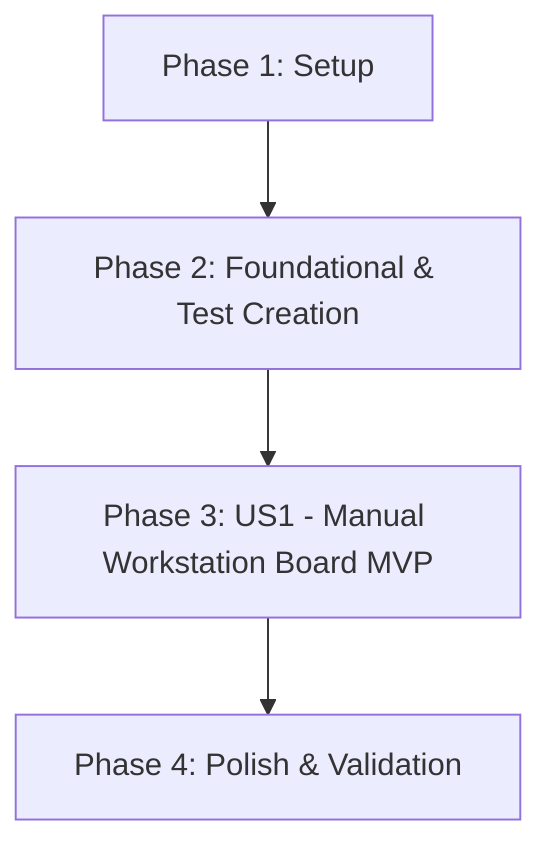

# Tasks: 04 - Planung Entgraten/Montieren (Nacharbeit & Montage)

**Input**: Design documents from [`specs/004-planung-entgraten-montieren/`](file:///C:/git_repos/ToolListInsights/specs/004-planung-entgraten-montieren/)  
**Prerequisites**: [`plan.md`](file:///C:/git_repos/ToolListInsights/specs/004-planung-entgraten-montieren/plan.md), [`spec.md`](file:///C:/git_repos/ToolListInsights/specs/004-planung-entgraten-montieren/spec.md), [`research.md`](file:///C:/git_repos/ToolListInsights/specs/004-planung-entgraten-montieren/research.md), [`data-model.md`](file:///C:/git_repos/ToolListInsights/specs/004-planung-entgraten-montieren/data-model.md), [`contracts/manual-workstation-api.json`](file:///C:/git_repos/ToolListInsights/specs/004-planung-entgraten-montieren/contracts/manual-workstation-api.json)

**Tests Requirement**: **MANDATORY** — Implement unit & contract test suite in `Features/04_Planung_Entgraten_Montieren/test.js` and register with `Features/run_tests.js`.

---

## Format: `[ID] [P?] [Story] Description`

- **[P]**: Can run in parallel (different files, no dependencies)
- **[Story]**: User story label (US1)
- Includes exact file paths for every task

---

## Phase 1: Setup (Shared Infrastructure)

**Purpose**: Environment and dependency verification for manual workstations

- [x] T001 Verify Feature 04 configuration per [`plan.md`](file:///C:/git_repos/ToolListInsights/specs/004-planung-entgraten-montieren/plan.md) in `package.json`
- [x] T002 [P] Verify manual workstation codes in `backend/server.js`

---

## Phase 2: Foundational (Blocking Prerequisites & Test Suite Creation)

**Purpose**: Data models and test suite harness for manual workstations

- [x] T003 Implement unit & contract test suite harness for manual workstations in `Features/04_Planung_Entgraten_Montieren/test.js`
- [x] T004 Register Feature 04 test suite in master test runner `Features/run_tests.js`
- [x] T005 [P] Define ManualWorkstation and ManualJobStep data models in `backend/models/manualWorkstation.js`

**Checkpoint**: Foundation & test harness ready — user story implementation can now begin.

---

## Phase 3: User Story 1 - Manual Workstation Capacity Planning (Priority: P1) 🎯 MVP

**Goal**: Render manual workstation Kanban board with worker headcount capacity limits and CNC completion readiness indicators.

**Independent Test**: Run `node Features/04_Planung_Entgraten_Montieren/test.js` for US1 tests and query `GET /api/planning?mode=manual`.

### Tests for User Story 1

- [x] T006 [P] [US1] Write test assertions for worker headcount capacity formula and CNC predecessor readiness in `Features/04_Planung_Entgraten_Montieren/test.js`

### Implementation for User Story 1

- [x] T007 [US1] Implement manual workstation capacity & schedule query endpoint `GET /api/planning?mode=manual` in `backend/server.js`
- [x] T008 [P] [US1] Build manual workstation header component with headcount controls in `frontend/src/components/ManualWorkstationHeader.jsx`
- [x] T009 [US1] Build manual workstation job card with green CNC readiness badge in `frontend/src/components/ManualJobCard.jsx`
- [x] T010 [US1] Integrate manual workstation board rendering in `frontend/src/App.jsx`

**Checkpoint**: User Story 1 MVP fully functional and testable independently.

---

## Phase 4: Polish & Cross-Cutting Concerns

**Purpose**: Scoped CSS isolation, theme tokens, and validation

- [x] T011 [P] Enforce strict scoped CSS isolation for manual workstation components to guarantee zero side-effects in `frontend/src/index.css`
- [x] T012 Execute master test runner `node Features/run_tests.js` and validate quickstart scenarios in [`quickstart.md`](file:///C:/git_repos/ToolListInsights/specs/004-planung-entgraten-montieren/quickstart.md)

---

## Dependencies & Execution Order

---

## Implementation Strategy

### MVP First (User Story 1 Only)
1. Complete Phase 1: Setup
2. Complete Phase 2: Foundational (Includes test harness creation in `Features/04_Planung_Entgraten_Montieren/test.js`)
3. Complete Phase 3: User Story 1
4. **STOP and VALIDATE**: Execute `node Features/04_Planung_Entgraten_Montieren/test.js` for US1
5. Polish & Final Validation (Phase 4)
