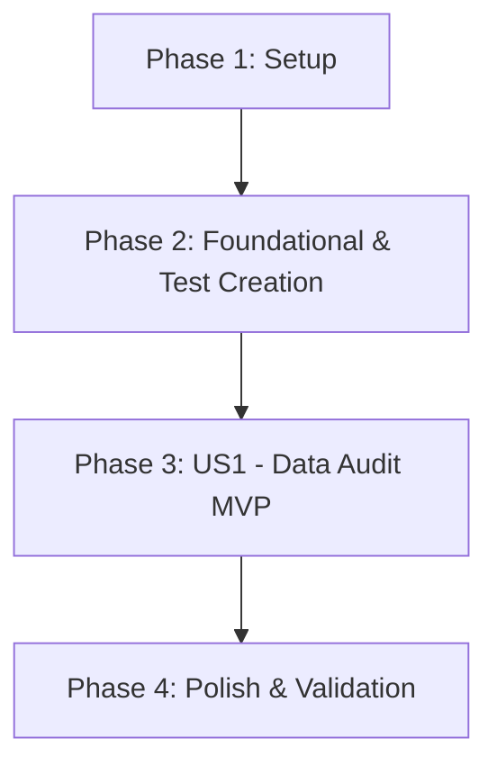

# Tasks: 07 - Datenvollständigkeit (Stammdaten-Audit & Fehlende Daten)

**Input**: Design documents from [`specs/007-datenvollstaendigkeit/`](file:///C:/git_repos/ToolListInsights/specs/007-datenvollstaendigkeit/)  
**Prerequisites**: [`plan.md`](file:///C:/git_repos/ToolListInsights/specs/007-datenvollstaendigkeit/plan.md), [`spec.md`](file:///C:/git_repos/ToolListInsights/specs/007-datenvollstaendigkeit/spec.md), [`research.md`](file:///C:/git_repos/ToolListInsights/specs/007-datenvollstaendigkeit/research.md), [`data-model.md`](file:///C:/git_repos/ToolListInsights/specs/007-datenvollstaendigkeit/data-model.md), [`contracts/data-audit-api.json`](file:///C:/git_repos/ToolListInsights/specs/007-datenvollstaendigkeit/contracts/data-audit-api.json)

**Tests Requirement**: **MANDATORY** — Implement unit & contract test suite in `Features/07_Datenvollstaendigkeit/test.js` and register with `Features/run_tests.js`.

---

## Format: `[ID] [P?] [Story] Description`

- **[P]**: Can run in parallel (different files, no dependencies)
- **[Story]**: User story label (US1)
- Includes exact file paths for every task

---

## Phase 1: Setup (Shared Infrastructure)

**Purpose**: Environment and dependency verification for master data audit

- [x] T001 Verify Feature 07 configuration per [`plan.md`](file:///C:/git_repos/ToolListInsights/specs/007-datenvollstaendigkeit/plan.md) in `package.json`
- [x] T002 [P] Verify master data audit fields in `backend/server.js`

---

## Phase 2: Foundational (Blocking Prerequisites & Test Suite Creation)

**Purpose**: Data models and test suite harness for master data audit

- [x] T003 Implement unit & contract test suite harness for master data audit in `Features/07_Datenvollstaendigkeit/test.js`
- [x] T004 Register Feature 07 test suite in master test runner `Features/run_tests.js`
- [x] T005 [P] Define DataAuditIssue and AuditedJobStep data models in `backend/models/dataAudit.js`

**Checkpoint**: Foundation & test harness ready — user story implementation can now begin.

---

## Phase 3: User Story 1 - Master Data Quality Audit Dashboard (Priority: P1) 🎯 MVP

**Goal**: Audit steps for missing NC/Fixture/ToolList or wrong machine, displaying Red, Orange, Yellow badges and DMS drawing buttons.

**Independent Test**: Run `node Features/07_Datenvollstaendigkeit/test.js` for US1 tests and query `GET /api/reports/data-completeness`.

### Tests for User Story 1

- [x] T006 [P] [US1] Write test assertions for master data audit predicates and completeness scoring in `Features/07_Datenvollstaendigkeit/test.js`

### Implementation for User Story 1

- [x] T007 [US1] Implement master data audit query endpoint `GET /api/reports/data-completeness` in `backend/server.js`
- [x] T008 [P] [US1] Build master data audit header card in `frontend/src/components/DataAuditHeader.jsx`
- [x] T009 [US1] Build master data audit breakdown grid with severity badges and DMS quick-launch buttons in `frontend/src/components/DataAuditGrid.jsx`
- [x] T010 [US1] Integrate master data audit view in `frontend/src/App.jsx`

**Checkpoint**: User Story 1 MVP fully functional and testable independently.

---

## Phase 4: Polish & Cross-Cutting Concerns

**Purpose**: Scoped CSS isolation, theme tokens, and validation

- [x] T011 [P] Enforce strict scoped CSS isolation for data audit components to guarantee zero side-effects in `frontend/src/index.css`
- [x] T012 Execute master test runner `node Features/run_tests.js` and validate quickstart scenarios in [`quickstart.md`](file:///C:/git_repos/ToolListInsights/specs/007-datenvollstaendigkeit/quickstart.md)

---

## Dependencies & Execution Order

---

## Implementation Strategy

### MVP First (User Story 1 Only)
1. Complete Phase 1: Setup
2. Complete Phase 2: Foundational (Includes test harness creation in `Features/07_Datenvollstaendigkeit/test.js`)
3. Complete Phase 3: User Story 1
4. **STOP and VALIDATE**: Execute `node Features/07_Datenvollstaendigkeit/test.js` for US1
5. Polish & Final Validation (Phase 4)
